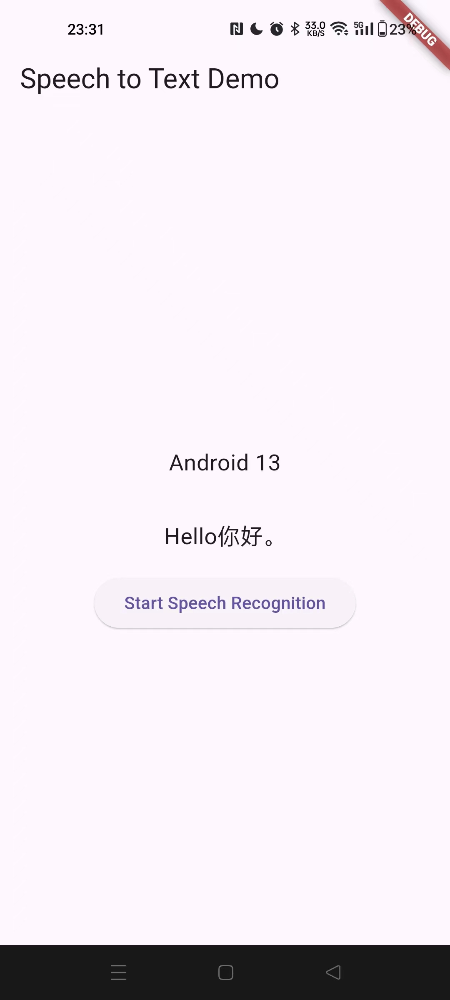

# flutter_azure_speech

Flutter implementation of [Microsoft Azure Speech service](https://learn.microsoft.com/en-us/azure/ai-services/speech-service/)

## Getting Started

Initialise the framework with your Region and Subscription key

```dart
Future<void> _initializeSpeechRecognition() async {
    try {
      await _flutterAzureSpeechPlugin.initialize(
          "YOUR SUBSCRIPTION KEY", "YOUR REGION");
    } catch (e) {
      print('Error initializing speech recognition: $e');
    }
  }
```

Obtain the text transcription of the speech by passing in the specific language

```dart
Future<void> _startSpeechRecognition() async {
    try {
      setState(() {
        _recognizedText = "Listening...";
      });

      String recognizedText =
          await _flutterAzureSpeechPlugin.getSpeechToText("zh-CN") ?? "";

      setState(() {
        _recognizedText = recognizedText;
      });
    } catch (e) {
      print('Error during speech recognition: $e');

      setState(() {
        _recognizedText = "An error occurred during speech recognition.";
      });
    }
  }
```

示例截图

 